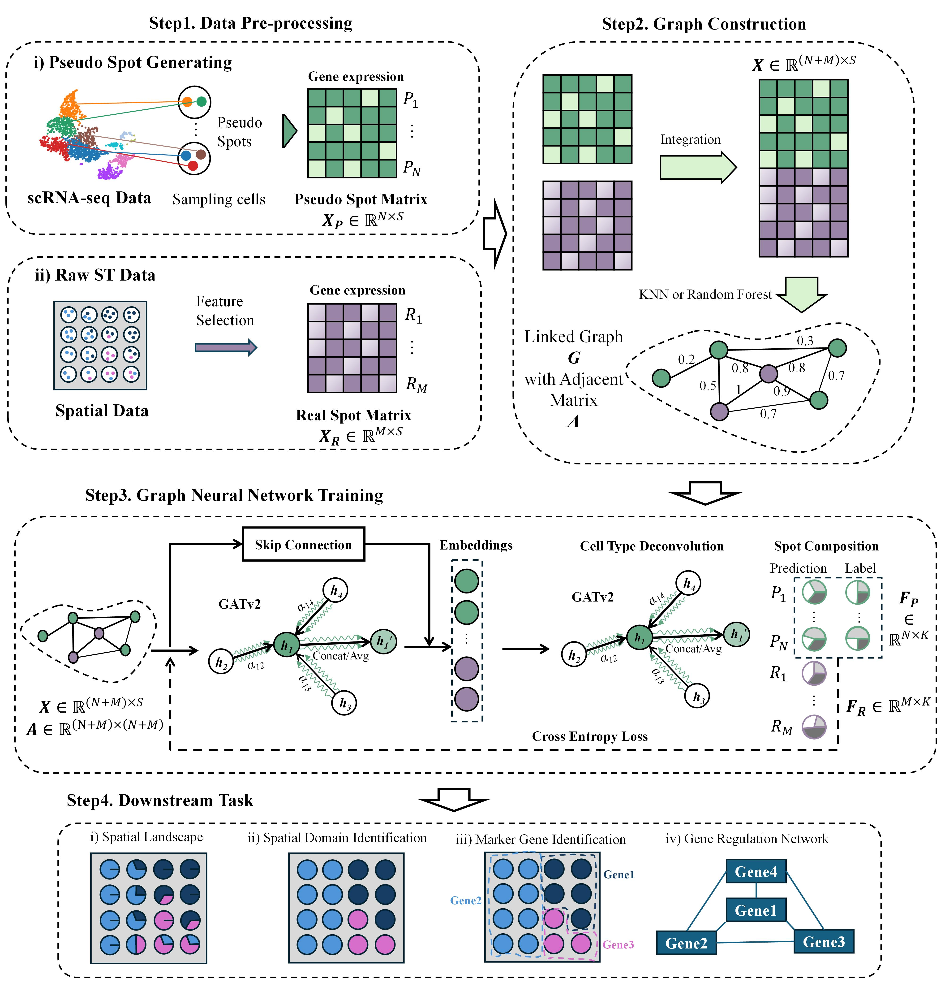

# Spider
Implementation of "Spider: accurate and robust unveiling cellular landscapes from spatially resolved transcriptomics data using decompositional network"  

## Requirements
### Python
    python == 3.8.*  
    torch == 2.1.1  
    torch_geometric == 2.5.3  
    scanpy == 1.9.8  
    scikit-learn == 1.3.2  
    scipy == 1.10.1  
    tqdm == 4.66.4  

### R
    R == 4.4.0  
    Seurat >=3.1.2

## How to run
First, you should have a 'data' folder in the root dir.

- For scRNA-seq, you will need 'sc_data.h5ad' and 'meta_data.csv', which respectively represent the gene expression matrix of its cells and metadata. 
- For the ST data, you will need 'st_data.h5ad', representing the gene expression matrix of spots.  

## Example on the PDAC-A data
Before running the model, the data preprocessing should be conducted (the data can be accessed directly from the git repository):  
1. Marker gene selection:  
    `python featureSelection.py --data_root ./data/PDAC-A`   
    Then you will get the **feature_list.txt** in the working dir.

2. Pseudo spots generation:   
    `python pseudoSpotGen.py --data_root ./data/PDAC-A --num_spots 3000`  
    Then you will get the corresponding **Infor_Data** folder under the working dir.
3. Integration between the Pseudo spots and real spots:  
    `Rscript integration.R`   
    Then the integrated mat will be accessed under the **Infor_Data** folder.
4. Link the graph:  
    `python graphLinking.py --data_root ./data/PDAC-A`  

Then the model can be trained:  
`python train.py --data_root ./data/PDAC-A`

Finally, the result files can be accessed in **data/PDAC-A/results** folder.