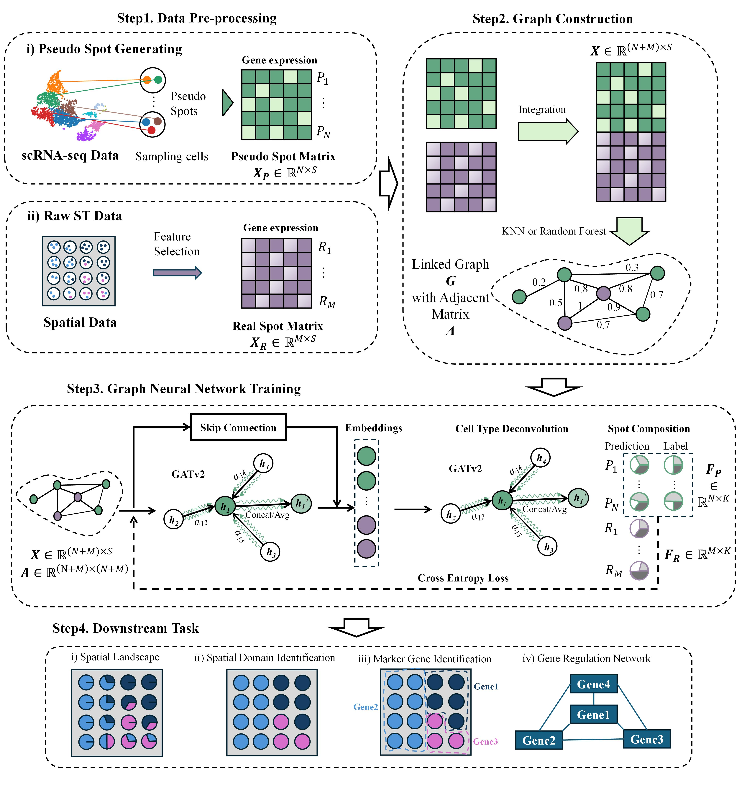

# Spall
Implementation of "Spall: accurate and robust unveiling cellular landscapes from spatially resolved transcriptomics data using decompositional network"  
## 1. Introduction
Spall is a cell proportion decomposition network for sequencing-based SRT data. Spall works in a transductive learning manner, employing geometric deep learning gene expression and location information of spots. In order to solve the problems occuring when balancing between predicting the continuity of cellular proportion distributions and capturing cell-specific information, we introduced GATv2 and skip-connection module.  

The process workflow includes 4 steps: (1) Data preprocessing: generation of pseudo spots from reference scRNA-seq data and feature selection both on original SRT and scRNA-seq data. (2) Integration and graph construction: data integration followed by graph construction using either KNN or Random Projection Forest, depending on dataset scale. (3) Graph neural network training: implementation of two GATv2 modules and one residual module. (4) Downstream analysis: application of decomposition results estimated by Spall to various analytical tasks.



## 2. Requirements
### Python
    python == 3.8.*  
    torch == 2.1.1  
    torch_geometric == 2.5.3  
    scanpy == 1.9.8  
    scikit-learn == 1.3.2  
    scipy == 1.10.1  
    tqdm == 4.66.4  

### R
    R == 4.4.0  
    Seurat >=3.1.2

## 3. How to run
You should have a 'data' folder under the root dir.

- For scRNA-seq, you will need 'sc_data.h5ad' and 'meta_data.csv', which respectively represent the gene expression matrix of its cells and metadata. 
- For the ST data, you will need 'st_data.h5ad', representing the gene expression matrix of spots.  

The organization of the project is:
```
Spall/
├─data/
│  └─PDAC-A/
│      |  sc_data.h5ad
│      |  st_data.h5ad
│      |  meta_data.csv
├─images/
├─post_analysis/
└─SpallUtils/
```


### Example on the PDAC-A data
Before running the model, the data preprocessing should be conducted (the PDAC data can be accessed from the google drive link: https://drive.google.com/drive/folders/1_hNfLJaAfvIsCqJMj-jGSVz7XP1E8w38?usp=drive_link):  
1. Marker gene selection:  
    ```
    python featureSelection.py --data_root ./data/PDAC-A
    ```   
    Then you will get the **feature_list.txt** in the working dir, representing the list of selected feature genes using SCANPY.

2. Pseudo spots generation:   
    ```
    python pseudoSpotGen.py --data_root ./data/PDAC-A --num_spots 3000
    ```  
    Then you will get the corresponding **Infor_Data** folder under the working dir. In the folder, you will see the generated pseudo spots data. See the explanation in the **data** folder organization
3. Integration between the Pseudo spots and real spots:  
    ```
    Rscript integration.R
    ```   
    Then the integrated mat, **integrated.csv** , will be accessed under the **Infor_Data** folder.
4. Link the graph:  
    ```
    python graphLinking.py --data_root ./data/PDAC-A
    ```  
    All of the processed data will be stored under the **Infor_Data/adjcent.npy** and **Infor_data/dataset.dat**


The processed **data** folder should be organized as:
```
├─data
│  └─PDAC-A
│      │  feature_list.txt       # selected gene features
│      │  meta_data.csv          # meta data for the scRNA data
│      │  sc_data.h5ad           # count data for scRNA-seq
│      │  st_data.h5ad           # count data for SRT data
|      |
│      ├─Infor_Data
│      │  │  adjcent.npy         # adjcent matrix
│      │  │  dataset.dat         # training data
│      │  │  integrated.csv      # integtated matrix
│      │  │
│      │  ├─ST_count
│      │  │      ST_count_1.csv  # count data for pseudo spots
│      │  │      ST_count_2.csv  # count data for real spots
│      │  │
│      │  └─ST_label
│      │         ST_label_1.csv  # labels for pseudo spots
│      │         ST_label_2.csv  # fake label, not used
```

Then the model can be trained:  
`python train.py --data_root ./data/PDAC-A`

Finally, the decomposed cell proportion result file can be accessed in **data/PDAC-A/results** folder.

### Result reproducing
You can access the post analysis script we prepared for reproducing through [this jupyter notebook](post_analysis/PDAC_post_analysis.ipynb)